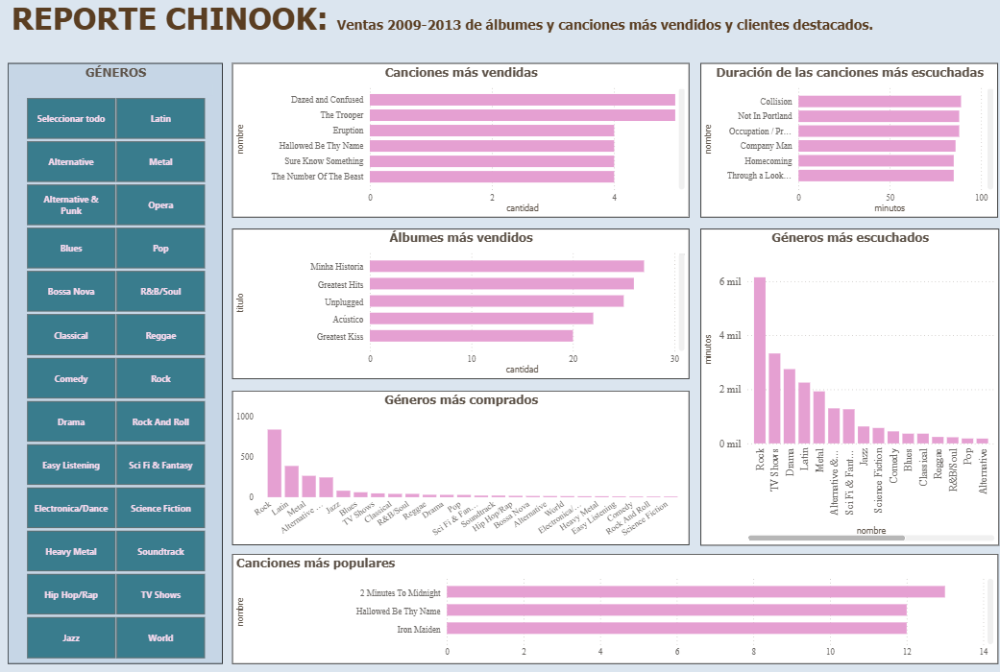
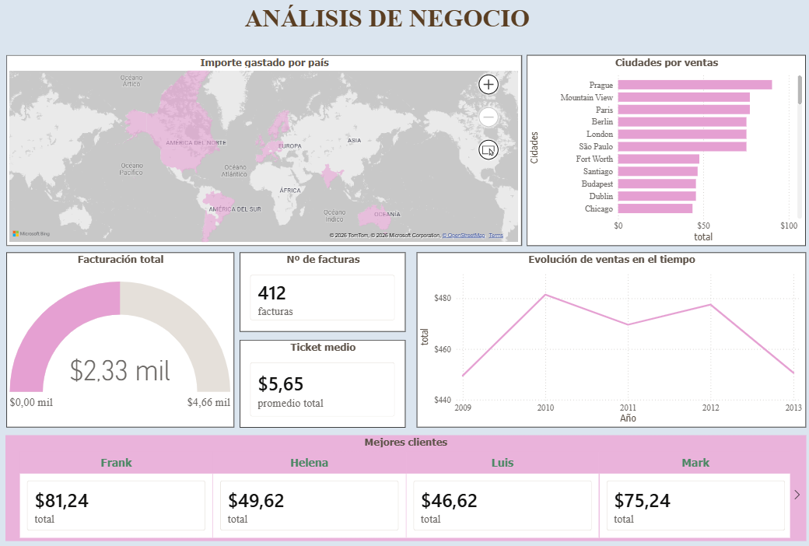

# 🎵 Reporte Chinook · Power BI

> Dashboard interactivo en **Power BI** sobre la base de datos **Chinook** (tienda de música digital). Analiza el catálogo musical y el negocio de facturación en dos páginas: **análisis musical** (qué se vende y qué es popular) y **análisis de negocio** (cuánto, dónde y cuándo se factura).


---

## 📊 Páginas del informe

### 1 · Reporte Chinook — Análisis musical
Segmentación por **género** (slicer) que filtra todos los visuales:
- 🎵 **Canciones más vendidas** (Top 10 por unidades)
- 💿 **Álbumes más vendidos** (Top por unidades)
- 🎸 **Géneros más comprados / más escuchados**
- ⏱️ **Duración de las canciones** (en minutos, calculada)
- 🔥 **Canciones más populares** (presencia en playlists)

### 2 · Análisis de negocio — Facturación
- 🌍 **Mapa mundial** de importe gastado por país
- 🏙️ **Ranking de ciudades** por ventas
- 💶 **KPIs de cabecera**: facturación total · nº de facturas · ticket medio
- 📈 **Evolución de ventas** 2009–2013
- 👥 **Mejores clientes** por gasto

---

## 🗃️ Datos

Base de datos **Chinook** exportada a Excel (`chinook_export.xlsx`). Tablas principales:

| Tabla | Contenido |
|-------|-----------|
| `tracks` | Canciones (nombre, duración, tamaño, género, álbum) |
| `albums` / `artists` | Catálogo de álbumes y artistas |
| `genres` | Géneros musicales |
| `invoices` / `invoice_items` | Facturas y líneas de venta |
| `customers` | Clientes |
| `playlists` / `playlist_track` | Listas de reproducción |

### Relaciones clave del modelo
```
invoice_items[TrackId]   → tracks[TrackId]
invoice_items[InvoiceId] → invoices[InvoiceId]
tracks[AlbumId]          → albums[AlbumId]
tracks[GenreId]          → genres[GenreId]
invoices[CustomerId]     → customers[CustomerId]
playlist_track[TrackId]  → tracks[TrackId]
```

> ⚠️ **Nota metodológica:** Chinook no registra reproducciones reales, solo ventas. Las métricas de "popularidad / escuchas" se aproximan mediante **unidades vendidas** (`invoice_items[Quantity]`) y **presencia en playlists** (`playlist_track`).

---

## 🧮 Cálculos DAX

Columnas y medidas creadas para el análisis:

```dax
-- Duración en minutos (numérico, para promedios y gráficos)
Minutos = DIVIDE(tracks[Milliseconds], 60000)

-- Duración en formato mm:ss (texto, para mostrar)
Duracion =
VAR TotalSeg = ROUND(tracks[Milliseconds] / 1000, 0)
VAR Min = INT(TotalSeg / 60)
VAR Seg = MOD(TotalSeg, 60)
RETURN Min & ":" & FORMAT(Seg, "00")
```

---

## 🛠️ Técnicas de Power BI aplicadas

- **Modelado relacional** entre tablas de hechos (ventas) y dimensiones (catálogo, clientes).
- **Filtros Top N** para rankings de canciones, álbumes y clientes.
- **Ordenar por columna** (meses cronológicos, no alfabéticos).
- **Agregaciones** (Suma, Promedio, Recuento) según la métrica.
- **Segmentación cruzada** (un slicer de género filtra toda la página).
- **Mapa geográfico** con categoría de datos País/Región.
- **KPIs con tarjetas** y formato de moneda.

---

## 🖼️ Capturas

### Análisis musical


### Análisis de negocio


---

## ▶️ Cómo abrirlo

1. Descarga el archivo `.pbix` de este repositorio.
2. Ábrelo con **Power BI Desktop** (gratuito).
3. Navega entre las dos páginas con las pestañas inferiores.

---

## 👤 Autora

**Thaís Brandão** — Data Engineering & AI
[GitHub](https://github.com/thaisbrandao)

Proyecto del itinerario de especialización en Ingeniería de Datos e IA.
